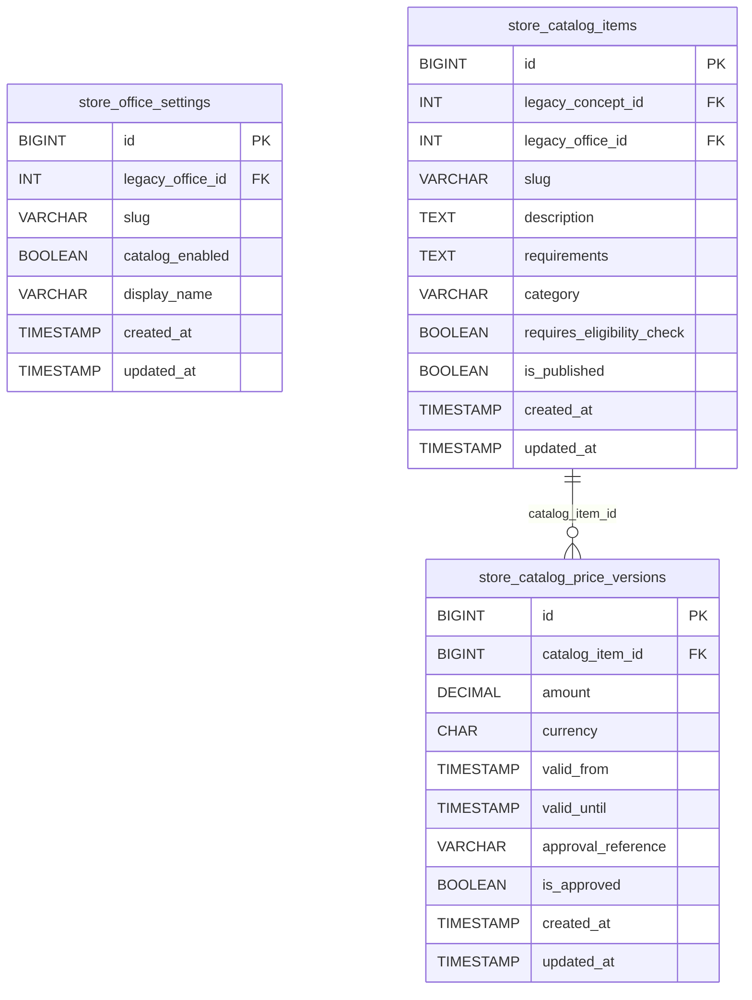

# Diagrama editable — catalogo

```mermaid
erDiagram
  store_office_settings {
BIGINT id PK
INT legacy_office_id FK
VARCHAR slug
BOOLEAN catalog_enabled
VARCHAR display_name
TIMESTAMP created_at
TIMESTAMP updated_at
  }
  store_catalog_items {
BIGINT id PK
INT legacy_concept_id FK
INT legacy_office_id FK
VARCHAR slug
TEXT description
TEXT requirements
VARCHAR category
BOOLEAN requires_eligibility_check
BOOLEAN is_published
TIMESTAMP created_at
TIMESTAMP updated_at
  }
  store_catalog_price_versions {
BIGINT id PK
BIGINT catalog_item_id FK
DECIMAL amount
CHAR currency
TIMESTAMP valid_from
TIMESTAMP valid_until
VARCHAR approval_reference
BOOLEAN is_approved
TIMESTAMP created_at
TIMESTAMP updated_at
  }
  store_catalog_items ||--o{ store_catalog_price_versions : "catalog_item_id"
```

Vista funcional. Consultar el diagrama general para relaciones externas al módulo.
