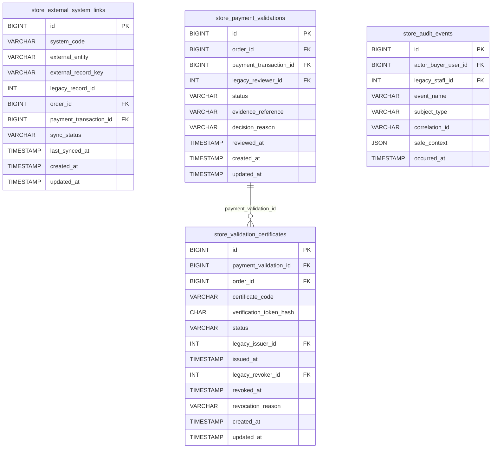

# Diagrama editable — control

```mermaid
erDiagram
  store_external_system_links {
BIGINT id PK
VARCHAR system_code
VARCHAR external_entity
VARCHAR external_record_key
INT legacy_record_id
BIGINT order_id FK
BIGINT payment_transaction_id FK
VARCHAR sync_status
TIMESTAMP last_synced_at
TIMESTAMP created_at
TIMESTAMP updated_at
  }
  store_payment_validations {
BIGINT id PK
BIGINT order_id FK
BIGINT payment_transaction_id FK
INT legacy_reviewer_id FK
VARCHAR status
VARCHAR evidence_reference
VARCHAR decision_reason
TIMESTAMP reviewed_at
TIMESTAMP created_at
TIMESTAMP updated_at
  }
  store_validation_certificates {
BIGINT id PK
BIGINT payment_validation_id FK
BIGINT order_id FK
VARCHAR certificate_code
CHAR verification_token_hash
VARCHAR status
INT legacy_issuer_id FK
TIMESTAMP issued_at
INT legacy_revoker_id FK
TIMESTAMP revoked_at
VARCHAR revocation_reason
TIMESTAMP created_at
TIMESTAMP updated_at
  }
  store_audit_events {
BIGINT id PK
BIGINT actor_buyer_user_id FK
INT legacy_staff_id FK
VARCHAR event_name
VARCHAR subject_type
VARCHAR correlation_id
JSON safe_context
TIMESTAMP occurred_at
  }
  store_payment_validations ||--o{ store_validation_certificates : "payment_validation_id"
```

Vista funcional. Consultar el diagrama general para relaciones externas al módulo.
