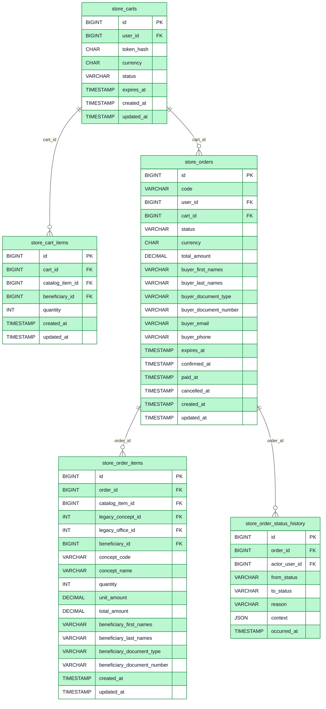

# Diagrama editable — pedidos

```mermaid
erDiagram
  store_carts {
BIGINT id PK
BIGINT user_id FK
CHAR token_hash
CHAR currency
VARCHAR status
TIMESTAMP expires_at
TIMESTAMP created_at
TIMESTAMP updated_at
  }
  store_cart_items {
BIGINT id PK
BIGINT cart_id FK
BIGINT catalog_item_id FK
BIGINT beneficiary_id FK
INT quantity
TIMESTAMP created_at
TIMESTAMP updated_at
  }
  store_orders {
BIGINT id PK
VARCHAR code
BIGINT user_id FK
BIGINT cart_id FK
VARCHAR status
CHAR currency
DECIMAL total_amount
VARCHAR buyer_first_names
VARCHAR buyer_last_names
VARCHAR buyer_document_type
VARCHAR buyer_document_number
VARCHAR buyer_email
VARCHAR buyer_phone
TIMESTAMP expires_at
TIMESTAMP confirmed_at
TIMESTAMP paid_at
TIMESTAMP cancelled_at
TIMESTAMP created_at
TIMESTAMP updated_at
  }
  store_order_items {
BIGINT id PK
BIGINT order_id FK
BIGINT catalog_item_id FK
INT legacy_concept_id FK
INT legacy_office_id FK
BIGINT beneficiary_id FK
VARCHAR concept_code
VARCHAR concept_name
INT quantity
DECIMAL unit_amount
DECIMAL total_amount
VARCHAR beneficiary_first_names
VARCHAR beneficiary_last_names
VARCHAR beneficiary_document_type
VARCHAR beneficiary_document_number
TIMESTAMP created_at
TIMESTAMP updated_at
  }
  store_order_status_history {
BIGINT id PK
BIGINT order_id FK
BIGINT actor_user_id FK
VARCHAR from_status
VARCHAR to_status
VARCHAR reason
JSON context
TIMESTAMP occurred_at
  }
  store_carts ||--o{ store_cart_items : "cart_id"
  store_carts ||--o{ store_orders : "cart_id"
  store_orders ||--o{ store_order_items : "order_id"
  store_orders ||--o{ store_order_status_history : "order_id"
  style store_carts fill:#BBF7D0,stroke:#15803D,color:#111827
  style store_cart_items fill:#BBF7D0,stroke:#15803D,color:#111827
  style store_orders fill:#BBF7D0,stroke:#15803D,color:#111827
  style store_order_items fill:#BBF7D0,stroke:#15803D,color:#111827
  style store_order_status_history fill:#BBF7D0,stroke:#15803D,color:#111827
```

Vista funcional. Consultar el diagrama general para relaciones externas al módulo.
